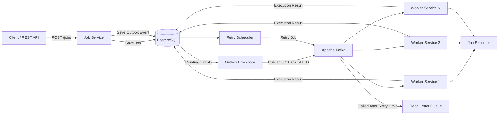
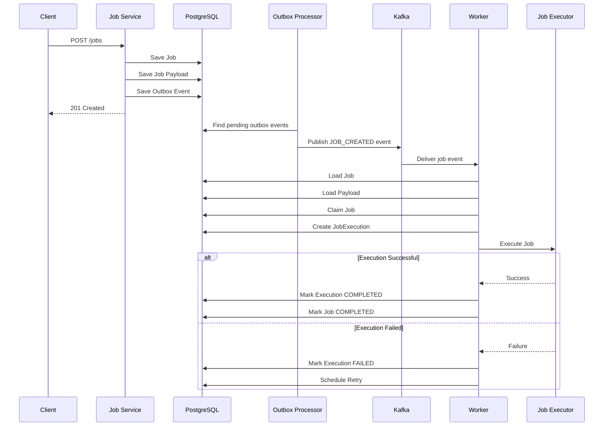

# Distributed Job Processing Platform

A distributed job processing platform built using **Java**, **Spring Boot**, **Apache Kafka**, **PostgreSQL**, **Docker**, and **Spring Data JPA**.

The goal of this project is to understand how production-inspired distributed job processing systems are designed and implemented. Instead of building a simple background-task application, this project focuses on important backend engineering problems such as **reliable job creation, asynchronous processing, idempotency, execution tracking, retries, failure handling, Dead Letter Queues, transactional consistency, and event-driven architecture**.

The project is being developed incrementally, with each feature implemented and tested before moving towards the next part of the system.

---

# Distributed Job Processing Platform

## 1. Project Overview

The Distributed Job Processing Platform is a backend system designed to accept jobs through REST APIs, persist them in PostgreSQL, publish job events through Apache Kafka, and process those jobs asynchronously using worker services.

The main purpose of this project is not only to execute jobs, but to understand what happens when distributed systems face problems such as:

- Kafka failures
- Worker crashes
- Duplicate messages
- Job execution failures
- Retry requirements
- Database consistency problems
- Multiple workers processing the same job
- Permanently failed jobs
- Need for execution history and debugging

The platform follows an **event-driven architecture** where Kafka acts as the messaging layer between job creation and job processing.

---

# 2. Main Goals

The project is being built to understand and implement:

- Event-driven architecture
- Asynchronous job processing
- Distributed workers
- Kafka producers and consumers
- Database-first job persistence
- Transactional Outbox Pattern
- Idempotent processing
- Job execution tracking
- Retry mechanisms
- Dead Letter Queue
- Failure handling
- Job lifecycle management
- Concurrent job claiming
- PostgreSQL transactions
- Docker-based local infrastructure
- Production-oriented backend design

---

# 3. High-Level Architecture

# 4. Job Processing Flow

The basic processing flow is:

