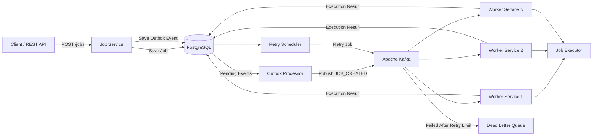
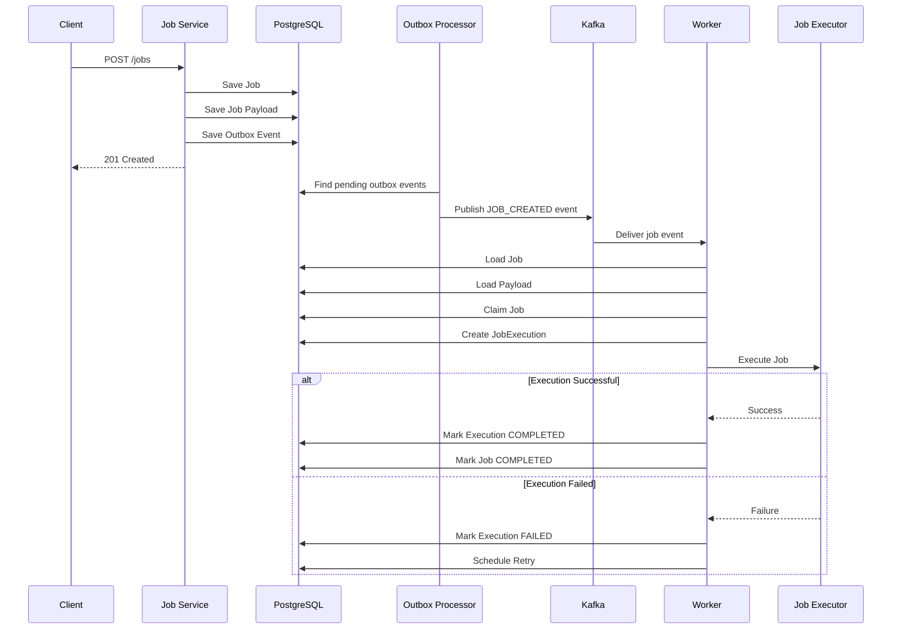
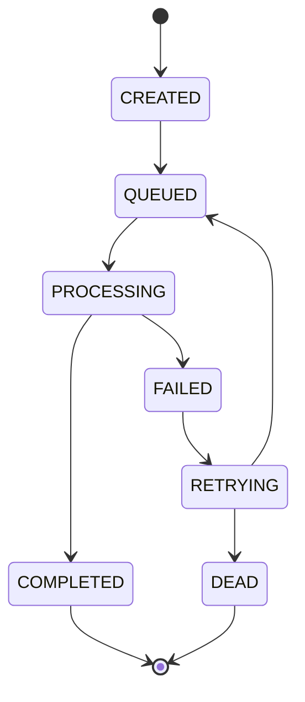
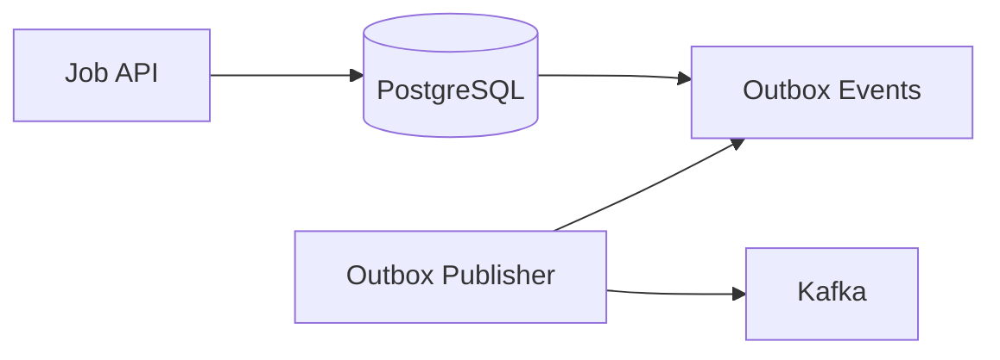

<div align="center">

# Distributed Job Processing Platform

A distributed job processing platform built using **Java**, **Spring Boot**, **Apache Kafka**, **PostgreSQL**, **Docker**, and **Spring Data JPA**.

The goal of this project is to understand how production-inspired distributed job processing systems are designed and implemented. Instead of building a simple background-task application, this project focuses on important backend engineering problems such as **reliable job creation, asynchronous processing, idempotency, execution tracking, retries, failure handling, Dead Letter Queues, transactional consistency, and event-driven architecture**.

The project is being developed incrementally, with each feature implemented and tested before moving towards the next part of the system.


</div>

---

# Distributed Job Processing Platform

## 1. Project Overview

The Distributed Job Processing Platform is a backend system designed to accept jobs through REST APIs, persist them in PostgreSQL, publish job events through Apache Kafka, and process those jobs asynchronously using worker services.

The main purpose of this project is not only to execute jobs, but to understand what happens when distributed systems face problems such as:

- Kafka failures
- Worker crashes
- Duplicate messages
- Job execution failures
- Retry requirements
- Database consistency problems
- Multiple workers processing the same job
- Permanently failed jobs
- Need for execution history and debugging

The platform follows an **event-driven architecture** where Kafka acts as the messaging layer between job creation and job processing.

---

# 2. Main Goals

The project is being built to understand and implement:

- Event-driven architecture
- Asynchronous job processing
- Distributed workers
- Kafka producers and consumers
- Database-first job persistence
- Transactional Outbox Pattern
- Idempotent processing
- Job execution tracking
- Retry mechanisms
- Dead Letter Queue
- Failure handling
- Job lifecycle management
- Concurrent job claiming
- PostgreSQL transactions
- Docker-based local infrastructure
- Production-oriented backend design

---

# 3. High-Level Architecture



# 4. Job Processing Flow

The basic processing flow is:


# 5. Job Lifecycle

The job lifecycle is designed around explicit state transitions.



The exact transition rules are controlled by the JobLifecycleService.

This prevents services from directly changing job status without checking whether the transition is valid

# 6. Job Execution Lifecycle

A job and a job execution are treated as two different concepts.

A Job represents the logical task submitted by the client.

A JobExecution represents one attempt to execute that job.

For example:
```
Job
 |
 +-- Execution #1 -> FAILED
 |
 +-- Execution #2 -> FAILED
 |
 +-- Execution #3 -> COMPLETED

```

This allows the system to maintain execution history instead of overwriting information from previous attempts.


# 7. Core Architecture Components

## Job Service

Responsible for:

Accepting job creation requests
Validating job information
Persisting jobs
Persisting job payloads
Creating outbox events
Providing job query APIs
Maintaining job lifecycle rules

## PostgreSQL

PostgreSQL acts as the source of truth for the platform.

Important data stored in PostgreSQL includes:

Jobs
Job payloads
Job executions
Execution history
Outbox events

The database is intentionally treated as the primary source of truth instead of relying only on Kafka.

## Apache Kafka

Kafka is used as the asynchronous messaging layer.

The main responsibility of Kafka is to transport job events from the producer side to worker services.

Example event:
``` 
{
  "eventId": "01M055MD015T4JM466JFT0BG3M",
  "jobId": "01M055MCV3MEX6V5PKASWZKV5N",
  "eventType": "JOB_CREATED"
}
```

Kafka allows multiple worker instances to process jobs using a consumer group.

## Worker Service

Workers consume job events from Kafka and execute jobs.


# 8. Transactional Outbox Pattern

The project uses the Transactional Outbox Pattern to avoid the dual-write problem.

Instead of doing:

```
Save Job
   |
   +--> Publish Kafka Event
```

the system performs:

Database Transaction
```
    Save Job
       +
    Save Payload
       +
    Save Outbox Event
        |
        v
     COMMIT
``` 
A separate process then publishes the pending outbox event to Kafka.



This prevents a situation where the job is successfully stored but the Kafka event is lost because Kafka was temporarily unavailable.

# 9. Idempotency

Duplicate Kafka delivery is expected in distributed systems.

The platform therefore uses an eventId to identify a specific event.

The job_executions table contains the event identifier and protects against duplicate execution attempts.

Conceptually:

```
Kafka Event
     |
     v
eventId
     |
     v
Already processed?
     |
   /   \
 Yes    No
 |       |
Ignore   Create Execution
         |
         v
       Execute
```
The database is used to enforce uniqueness rather than relying only on application-level checks.

# 10. Concurrent Job Claiming

Multiple workers may receive messages for jobs at the same time.

The worker therefore does not simply change the job status blindly.

Instead, it attempts to claim the job using a conditional update.

Conceptually:
```sql
UPDATE jobs
SET status = 'PROCESSING'
WHERE job_id = ?
AND status = 'QUEUED';
```
The important part is:

``` WHERE status = QUEUED ```

Only one worker should successfully change the job from QUEUED to PROCESSING.

This prevents multiple workers from processing the same job simultaneously.

# 11. Job Execution Tracking

Each execution attempt is stored separately.

The execution record contains information such as:
```
executionId
jobId
eventId
status
workerId
startedAt
completedAt
errorMessage
``` 
This makes it possible to answer questions such as:

Which worker processed the job?
When did execution start?
When did it finish?
How many attempts were made?
Why did an execution fail?

# 12. Retry Mechanism

When a worker fails to execute a job, the job is not immediately considered permanently failed.

Instead:
```
PROCESSING
     |
     v
FAILED
     |
     v
RETRYING
     |
     v
Next Retry Time
     |
     v
QUEUED
     |
     v
PROCESSING
```
The job maintains retry-related information such as:
```
retryCount
nextRetryAt
```
The retry scheduler looks for jobs whose retry time has arrived and makes them available for processing again.

# 13. Dead Letter Queue

The Dead Letter Queue is intended for jobs that cannot be successfully processed after the configured retry limit.

Conceptually:
```
flowchart TD

    Processing["Processing"]

    Processing --> Success["Success"]
    Processing --> Failure["Failure"]

    Failure --> Retry["Retry"]

    Retry --> Processing

    Retry --> Limit{"Retry Limit Reached?"}

    Limit -->|No| Processing
    Limit -->|Yes| DLQ["Dead Letter Queue"]

    DLQ --> Manual["Manual Investigation"]
```
The DLQ allows permanently failed jobs to be retained instead of silently losing them.

# 17. Features Implemented
## Job Management
 [x] Job creation API
 [x] Job persistence
 [x] Job payload persistence
 [x] Job status management
 [x] Job priority
 [x] Retry count tracking
 [x] Next retry time tracking
 [x] Job query APIs
## Event-Driven Processing
 [x] Kafka integration
 [x] Kafka producer
 [x] Kafka consumer
 [x] Job-created events
 [x] Consumer group based worker processing
 [x] Asynchronous job execution
## Reliability
 [x] PostgreSQL as source of truth
 [x] Transactional job creation
 [x] Transactional Outbox Pattern
 [x] Outbox event persistence
 [x] Outbox event publishing
 [x] Duplicate event detection
 [x] Execution tracking
 [x] Worker identification
 [x] Job claiming using conditional update
## Execution Management
 [x] Job execution records
 [x] Execution status
 [x] Execution start time
 [x] Execution completion time
 [x] Error message storage
 [x] Execution history
 [x] Execution detail API
## Retry Handling
 [x] Retry count
 [x] Retry scheduling information
 [x] Retry scheduler
 [x] Retry state
 [x] Failure recording
## Infrastructure
 [x] Docker setup
 [x] Docker Compose
 [x] PostgreSQL container
 [x] Kafka container
 [x] Kafka UI
 [x] Local development environment

# 18. Features Currently Being Worked On

The following areas are still under development or require further testing:

 Finalize job lifecycle transitions
 Finalize retry state transitions
 Complete retry flow testing
 Dead Letter Queue integration
 Failed job recovery
 Better Kafka error handling
 Better worker failure handling
 End-to-end failure testing
 Concurrent worker testing
 Retry limit enforcement
 Manual DLQ processing
 
# 19. Features Yet to Implement
## Reliability
 Better transactional boundaries
 Improved failure recovery
 Worker crash recovery
 Stuck execution detection
 Job timeout handling
 Execution heartbeat
 Graceful worker shutdown
## Kafka
 Production-ready retry topics
 Dead Letter Topic
 Better partitioning strategy
 Consumer lag monitoring
 Kafka message headers for retry metadata
 Improved producer error handling
 Kafka security configuration
## Job Processing
 Multiple job types
 Job timeout configuration
 Job cancellation
 Job pause/resume
 Scheduled jobs
 Delayed jobs
 Job dependency support
## Retry System
 Configurable maximum retries
 Exponential backoff
 Fixed backoff configuration
 Retry policies per job type
 Retry history
 Manual retry
 Retry monitoring
## Dead Letter Queue
 DLQ topic
 DLQ database tracking
 Failed job inspection
 Manual replay
 Manual discard
 DLQ monitoring
## Security
 Authentication
 Authorization
 Role-based access control
 API security
 Kafka authentication
 Database credential management
## Observability
 Structured logging
 Correlation IDs
 Distributed tracing
 Metrics
 Prometheus
 Grafana
 Kafka consumer metrics
 Job processing metrics
## Testing
 Unit tests
 Repository tests
 Service tests
 Kafka integration tests
 End-to-end tests
 Concurrent worker tests
 Failure scenario tests
 Retry scenario tests
 DLQ tests
 Testcontainers integration
## Deployment
 Production Docker images
 Kubernetes deployment
 Kubernetes ConfigMaps
 Kubernetes Secrets
 Horizontal worker scaling
 Health checks
 Readiness probes
 Liveness probes
 CI/CD pipeline

